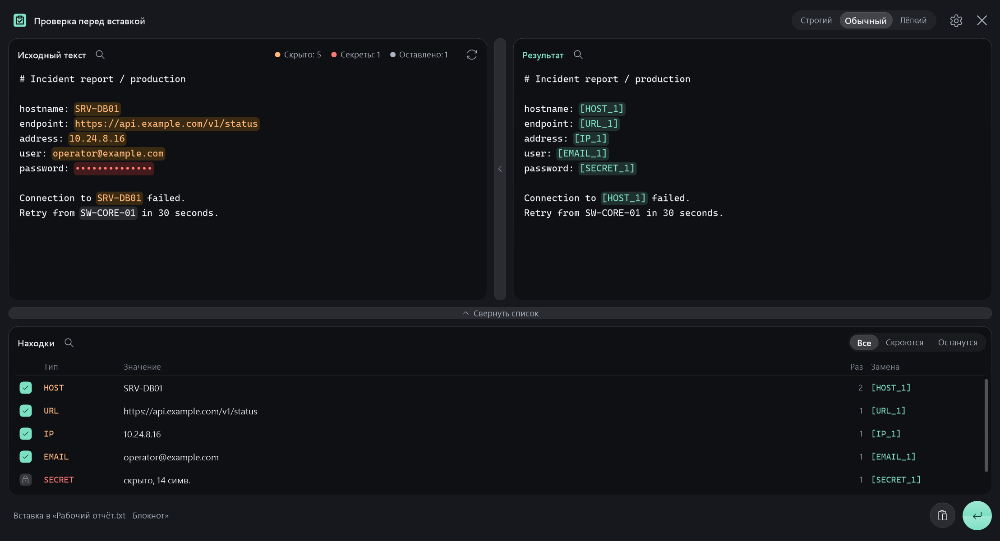
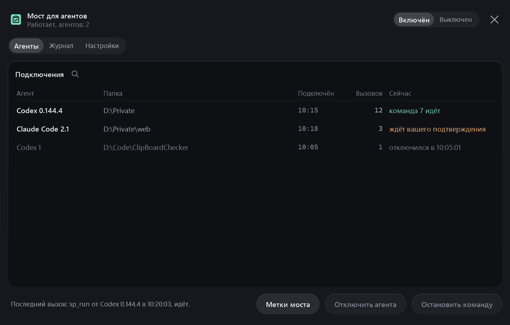

# SafePaste

Локальный инструмент для Windows: проверяет текст и картинки из буфера обмена и закрывает
идентификаторы и секреты перед вставкой в другое приложение (чат с ИИ, тикет, переписку).



> Проект в закрытой разработке, публичный выпуск готовится:
> [docs/PUBLIC-LAUNCH.md](docs/PUBLIC-LAUNCH.md).

Инструкция на одну страницу лежит в [QUICKSTART.md](QUICKSTART.md), устройство кода описано
в [docs/ARCHITECTURE.md](docs/ARCHITECTURE.md).

## Гарантии

- SafePaste не отправляет данные в сеть без запроса: `sp_ask_local` обращается только к локальной
  модели на этом компьютере (по умолчанию `127.0.0.1:8081`, адрес вне компьютера не принимается).
  При использовании MCP-моста обезличенные ответы получает ИИ-клиент.
- Журнал вызовов моста живёт только в памяти SafePaste и хранит то, что видел агент.
- Исходный текст не пишется на диск и не попадает в журналы.
- Отмеченные вручную значения и исключения лежат в `%LOCALAPPDATA%\SafePaste\database.dat`,
  файл зашифрован DPAPI для текущей учётной записи Windows.
- Запомненные метки вставок и моста и их значения лежат в зашифрованном
  `%LOCALAPPDATA%\SafePaste\labels.dat`; метка, которая не встречалась 30 дней, удаляется сама.
- Пароли, токены и приватные ключи в базу и в метки не сохраняются никогда.
- При любой ошибке (база недоступна, детектор не уложился во время) вставка отменяется.
- Одинаковые значения в одной вставке получают одну и ту же метку: `[HOST_1]`, `[IP_2]`.
- Закреплённые значения получают один и тот же номер во всех вставках (см. ниже).

## Сборка

Нужна только Windows: компилятор C# входит в .NET Framework 4.x, который уже есть в системе.
SDK, Visual Studio и NuGet не требуются.

```bash
build.cmd
```

Результат: один `bin\SafePaste.exe`. Без параметров он работает в трее и держит мост для
ИИ-агентов; с `--mcp` подключает агента к этому мосту по stdio, с `--hook` запускает хук,
с `--filter` обезличивает stdin в stdout. Тесты:

```bash
build.cmd test
```

`build.cmd mcp` собирает тот же единый exe; `build.cmd check` запускает тесты и UI-проверки.

## Мост для ИИ-агентов

Мост работает внутри SafePaste в трее и даёт Codex и Claude инструменты `sp_status`, `sp_list`,
`sp_read`, `sp_find`, `sp_run`, `sp_next`, `sp_hide`, `sp_edit`, `sp_write`, `sp_ask_local`.
Клиент запускает `SafePaste.exe --mcp`: это разъём, который подключается к мосту по каналу,
открытому только вашей учётной записи, и сам запускает SafePaste, если тот не запущен.
Ответы обезличиваются; метки общие между агентами и вставкой из буфера. По умолчанию
`sp_run` работает в ограниченном PowerShell. Полный профиль (`profile: full`) и файловые
правки требуют подтверждения в локальном окне.

Строка «Мост для агентов» в окне «Настройки» (пункт меню значка или шестерёнка в шапке окна
проверки) показывает состояние и открывает окно моста:

- переключатель «Включён» и «Выключен»: выключенный мост не принимает агентов, подключённые
  отключаются;
- «Агенты»: кто подключён, из какой папки, сколько вызовов и что делает сейчас, а ниже серым
  те, кто отключился за последний час; кнопки «Остановить команду», «Отключить агента»
  и «Метки моста»;
- «Журнал»: последние 200 вызовов с запросом и обезличенным ответом, двойной щелчок открывает
  подробности и показывает реальные значения на экране;
- «Настройки»: папки для агентов, полный PowerShell, правка файлов, поиск локальной модели,
  размер страницы. Изменения действуют сразу, в том числе для подключённых агентов.



### Подключение локальной модели

1. Запустите локальный сервер. Поддерживаются Ollama (порт `11434` или порт из `OLLAMA_HOST`),
   LM Studio (`1234`) и OpenAI-совместимый API llama.cpp (`8080` или `8081`). У Ollama видны все
   скачанные модели: загружать модель заранее не нужно, сервер загрузит её при первом запросе.
   В LM Studio и llama.cpp модель должна быть загружена.
2. Откройте «Мост для агентов» → «Настройки» → «Найти и подключить ИИ». Щёлкните по модели в
   списке, и она подключится. У моделей Ollama справа видно, в памяти ли модель или только скачана.
   Поиск можно повторить кнопкой «Найти снова». Если Ollama установлена, но не запущена, в окне
   появится кнопка «Запустить Ollama», после запуска поиск повторится сам.
3. Если сервер работает на другом порту, откройте «Дополнительно» и укажите полный локальный URL
   `/v1/chat/completions` и имя модели, которое принимает API. Ручное сохранение не проверяет ответ
   модели; после него проверьте подключение вызовом `sp_ask_local`.

**Рекомендации:** для первого подключения скачайте или загрузите одну текстовую модель, проверьте,
что сервер принимает запросы, и затем откройте поиск. Если список пуст, проверьте, что API-сервер
запущен, а в LM Studio и llama.cpp модель именно загружена, а не только скачана. Модели Ollama для
векторов (`embed`) в список не попадают: отвечать текстом они не умеют. SafePaste обращается
к адресу на этом компьютере; убедитесь, что сам сервер не пересылает запросы в облако: задача
и выбранные файлы передаются ему с реальными значениями. Ответ модели обезличивается перед
возвратом агенту.

Справка по API: [Ollama](https://docs.ollama.com/api/openai-compatibility),
[LM Studio](https://lmstudio.ai/docs/developer/rest/list),
[llama.cpp](https://github.com/ggml-org/llama.cpp/blob/master/tools/server/README.md).

Установщик создаёт конфигурацию отдельной приватной папки и добавляет папки в настройки моста:

```powershell
pwsh integrations/install.ps1 -Workspace <папка> -Roots <разрешённая папка> -Codex
```

Параметр `-Claude` добавляет настройки Claude, `-DataDir` указывает другую папку данных
SafePaste. Сначала проверьте установку на временных каталогах. Устройство моста и ограничения
описаны в [docs/MCP-BRIDGE.md](docs/MCP-BRIDGE.md).

Проверка интерфейса запускается командой `build.cmd uitest`. Она работает на вымышленных
данных и во временной базе, реальные буфер обмена и правила не трогает, а снимки окон
кладёт в `bin\ui-preview`. `build.cmd preview` собирает `bin\SafePaste.Preview.exe` для ручной
проверки на демонстрационных данных; в нём `F8` открывает то же меню, что и значок в трее.

Иконка встроена в EXE. Её исходник находится в `IconArtwork` (`src/SafePaste/Ui/AppIcon.cs`);
при сборке `tools/BuildIcon.cs` делает из него ICO с размерами от 16 до 256 px и PNG-превью.

Автозапуск: «Настройки» → «Запускать при входе в Windows». SafePaste запишет себя в
`HKCU\Software\Microsoft\Windows\CurrentVersion\Run` с флагом `--autostart` (права администратора
не нужны) и при входе стартует молча. При ручном запуске SafePaste сообщает уведомлением, что
запущен и где искать значок. Если программу перенесли в другую папку, выключатель покажет
«выключено»: включите его снова, чтобы запускался новый файл.

## Горячие клавиши

- `Ctrl+Shift+V`: быстрая вставка текста без окна. Что скрывается, зависит от режима (см. ниже);
  в обычном режиме это обязательные секреты, надёжные находки и значения, которые вы отметили раньше.
  Если в буфере картинка, откроется окно проверки: распознавание может пропустить секрет.
- `Ctrl+Alt+Shift+V`: окно проверки. Видно, что и чем заменится; можно оставить значение,
  отметить пропущенное или добавить исключение. Картинка из буфера открывается в этом же окне.
  Если буфер пуст, окно открывается без содержимого: текст можно вставить или набрать прямо в нём.
- `Ctrl+Shift+C`: расшифровка. Выделите текст с метками (например, ответ ИИ) и нажмите
  сочетание: SafePaste сам скопирует выделенное и покажет его с реальными значениями вместо
  меток (см. «Расшифровка» ниже). Если ничего не выделено, берётся текст из буфера.

То же самое есть в меню значка в области уведомлений: проверка, быстрая вставка, «Показать
с реальными значениями» (та же расшифровка текста из буфера), режим, «Настройки», справка
и выход. Щелчок по шапке меню с названием SafePaste открывает окно проверки, как и двойной
щелчок по значку.

«Настройки» открываются отдельным окном, его же открывает шестерёнка в шапке окна проверки.
Всё на одной странице группами, изменения сохраняются сразу:

- «Запуск»: «Запускать при входе в Windows» и «Предупреждать о журнале буфера»;
- «Проверка и метки»: «Интеллектуальный анализ», «Запоминать метки», «Скрывать запомненное»;
- «Правила и агенты»: переходы в «Правила и исключения» и «Мост для агентов» с его состоянием.

Щёлкнуть можно по любому месту строки. С клавиатуры: стрелки вверх и вниз, Пробел или Enter,
`Esc` закрывает окно.

## Окно проверки

По умолчанию это один блок с исходным текстом, чтобы проверка занимала секунды. Находки
подсвечены прямо в тексте: оранжевым то, что заменится, серым то, что останется, красным
пароли и ключи (в тексте и в списке они показаны точками). В шапке блока цветные точки
показывают, сколько значений скрыто, сколько секретов и сколько останется.

- **Наведение** на подсветку показывает, на что заменится значение, что это за тип
  и сколько раз оно встречается. У пароля в подсказке само значение: так видно, что именно
  принято за пароль. То же при наведении на метку в результате и на строку списка.
- **Правый клик** по подсветке открывает действия со значением: «Не скрывать» или «Скрыть»,
  «Закрепить номер», «Скрывать всегда», «Никогда не скрывать». У пароля, токена и ключа пунктов
  два: «Не скрывать в этот раз» оставляет значение только в этой проверке (до смены режима,
  снова скрыть можно тем же правым кликом), «Распознано ошибочно» запоминает, что это не пароль,
  и дальше SafePaste его паролем не считает. Снять такую отметку можно в «Правилах
  и исключениях» (строка «Не пароль»). Правый клик по выделенному
  фрагменту: «Отметить» скрывает его меткой `[HIDE_TEXT_N]` и запоминает правило, «Пометить как»
  раскрывает типы, которые подходят к выделенному (IP-адресом не пометить ФИО, путём строку
  без разделителей). Сначала идут типы, чей вид совпал с текстом, дальше те, что вы выбираете
  чаще. Там же «Отметить без сохранения»: скрыть только в этот раз, без правила и без метки.
  Пункт, который к этому месту не применить, в меню не показывается, а правка, поиск и замена
  всего текста в меню не повторяются: для них есть кнопки и сочетания клавиш.
- **Правка текста** идёт прямо в блоке, как в блокноте: курсор, выделение мышью и клавишами,
  `Ctrl+X`, `Ctrl+C`, `Ctrl+V`, отмена `Ctrl+Z` и повтор `Ctrl+Y`. После паузы в наборе текст
  проверяется заново, а решения по значениям (оставить, скрыть, отмеченное вручную) сохраняются.
  Пока текст не проверен, пароль, внутри которого идёт правка, остаётся закрытым точками. Перед
  вставкой и копированием результата текст всегда проверяется заново.
- **Кнопка во всю высоту справа** открывает блок с результатом, окно расширяется вправо.
  Исходный текст и результат прокручиваются вместе. Наведение на метку в результате
  показывает, что было на её месте.
- **Кнопка внизу** открывает список всех находок: галочки, фильтр «Все / Скроются / Останутся»,
  те же действия по правому клику. Чёрточка вместо галочки значит, что скрыта только часть
  вхождений. `Пробел` переключает выбранные строки.
- **Поиск** есть в каждом блоке: лупа рядом с названием превращает его в поле ввода,
  совпадения подсвечиваются сразу при вводе. `Enter` и `F3` ведут к следующему,
  `Shift+Enter` и `Shift+F3` к предыдущему, `Esc` закрывает поиск.
- **Новый текст** подставляется без закрытия окна: `Ctrl+V` вставляет текст в место курсора
  (чтобы заменить всё, сначала `Ctrl+A`), круговые стрелки в шапке блока заменяют весь текст
  содержимым буфера, текст можно и перетащить мышью.

Открытые панели запоминаются в `settings.json`. Кнопки внизу справа сделаны значками
с подписью при наведении: мятная стрелка вставляет результат (`Ctrl+Enter`), значок буфера
копирует его без вставки (`Ctrl+S`). Окно закрывается крестиком или `Esc`, шестерёнка рядом
с крестиком открывает окно настроек. Если окно для вставки не найдено, главной кнопкой становится
значок буфера. Кнопки подсвечиваются плавно и чуть утапливаются при нажатии, шестерёнка
и крестик поворачиваются при наведении. Если в Windows выключены эффекты анимации
(«Специальные возможности» → «Визуальные эффекты»), всё меняется сразу, без движения.

### Вкладки

Пока окно проверки открыто, каждое `Ctrl+C` в любой программе открывает скопированный текст
новой вкладкой: у каждой вкладки свои находки, решения и история правок. Над блоками появляется
полоска вкладок (номер и первая строка, секреты закрыты точками), `Ctrl+Tab` и `Ctrl+Shift+Tab`
переключают вкладки, `Ctrl+W` или крестик закрывает вкладку.

- `Ctrl+Enter` вставляет открытую вкладку и закрывает её, а окно с остальными вкладками остаётся
  в фоне: `Ctrl+Alt+Shift+V` вернёт его. Последняя вкладка вставляется с закрытием окна, как раньше.
- `Ctrl+Shift+Enter` (кнопка между копированием и вставкой) вставляет все вкладки проверки одним текстом
  через пустую строку. Номера считаются по всему тексту сразу: одно значение в разных вкладках
  получает одну метку, разные значения разные.
- Копия, которая уже открыта, только переключает на свою вкладку; пустое окно принимает первую
  копию, а не открывает рядом вторую вкладку. Вкладок не больше 12.

В фоне SafePaste копии не собирает: закрыли окно, и вкладок больше нет. Свои записи в буфер
(результат, очистка) и копии, которые программа просит не отслеживать (так делают менеджеры
паролей), вкладками не открываются.

### Картинки

Когда в буфере нет текста, но есть картинка, SafePaste открывает её во вкладке и локально
распознаёт текст средствами Windows. Находки отмечаются рамками; справа можно открыть готовую
картинку с закрытыми местами. Правый клик по рамке даёт действия с находкой, а мышью можно
нарисовать рамку вокруг того, что распознавание пропустило. Кнопка с буквами показывает
распознанный текст. `Ctrl+T` вставляет этот текст вместо картинки.

В снимках уведомлений SafePaste объединяет разделённые OCR части IP-адреса и отмечает имена
узлов рядом с сообщениями мониторинга. Служебное время со значком часов не обводится как
непрочитанный текст в обычном режиме; строгий режим по-прежнему закрывает его.

Перед вставкой готовая картинка проверяется ещё раз. `Ctrl+Enter` вставляет текущую картинку,
`Ctrl+S` копирует её в буфер; если открыты другие вкладки, они остаются в окне. В строгом режиме
места, похожие на непрочитанный текст, закрываются автоматически. Проверьте картинку глазами:
распознавание может пропустить мелкий или повёрнутый текст, рукопись, QR-коды и лица. Если
распознавание Windows недоступно, закройте нужные места рамками вручную. История буфера `Win+V`
может хранить исходную копию. Подробнее: [docs/IMAGES.md](docs/IMAGES.md).

### Расшифровка

`Ctrl+Shift+C` открывает окно в режиме расшифровки: вместо меток реальные значения. Выделенное
SafePaste копирует сам, нажатием `Ctrl+Insert`: в терминале, в отличие от `Ctrl+C`, оно не
прерывает команду, а в Windows Terminal копирование по `Ctrl+Shift+C` при этом не теряется.
В окно, запущенное от администратора, нажатие не пройдёт, тогда берётся текст из буфера.

- Шапка окна называется «Расшифровка», блок «Реальные значения». Восстановленные значения
  подсвечены едва заметно, наведение показывает метку и откуда значение: закреплённый номер или
  запомненная метка.
- Метки, которые расшифровать нельзя, подсвечены оранжевым. Наведение объясняет почему: такой
  метки нет среди запомненных (она забылась или пришла из другой переписки) или это пароль и ключ,
  которые SafePaste не сохраняет. `[~HOST_1]` становится текстом `[HOST_1]`, отметки сторожа
  моста `[SPLIT:...]` и `[ENCODED:...]` тоже расшифровываются.
- Расшифрованный текст только читается. `Ctrl+S` и `Ctrl+Enter` копируют его, в чужое окно
  SafePaste его не вставляет: обычно там та самая переписка с ИИ.
- Если окно проверки уже открыто, `Ctrl+Shift+C` добавляет в него вкладку расшифровки, она помечена
  открытым замком. Новые копии, сделанные на вкладке расшифровки, тоже открываются расшифровкой.
  «Вставить все» вкладки расшифровки не вставляет.

## Режимы

Режим задаёт, что скрывается по умолчанию. Он один на всё приложение: переключается в шапке
окна проверки (`Ctrl+1`, `Ctrl+2`, `Ctrl+3`) или в меню значка, запоминается и действует
и на быструю вставку.

| Режим | Окно проверки | Быстрая вставка |
| --- | --- | --- |
| Строгий | скрыто всё найденное, даже догадки и пути целиком | то же: всё найденное |
| Обычный | всё, кроме догадок с низкой надёжностью и путей | секреты, надёжные находки и ваши правила |
| Лёгкий | только пароли, ключи и ваши правила | то же |

Пароли, токены и ключи скрываются в любом режиме, кроме отмеченных «Распознано ошибочно».
Исключения на них не действуют: исключение для имени узла не откроет пароль с тем же текстом.
«Ваши правила» здесь значат значения,
которые вы отметили или попросили скрывать всегда. Исключения («Никогда не скрывать») тоже
действуют во всех режимах. При переключении режима в окне проверки галочки у всех находок
ставятся заново.

В окне «Настройки» (меню значка или шестерёнка окна проверки) есть переключатель
«Интеллектуальный анализ». Он включён по умолчанию и работает в **строгом, обычном и лёгком**
режимах, включая быструю вставку. Анализ ищет секрет после обозначения пароля, кода или токена
в обычной фразе, даже без `:` и `=`: `Пароль 1290!!!Iva уже не подходят` скрывает только
`1290!!!Iva`. Поддерживаются слова-маркеры на русском (RU), английском (EN), украинском (UK),
немецком (DE), французском (FR), испанском (ES), португальском (PT), итальянском (IT), польском
(PL) и турецком (TR). Это контекстные правила для этих языков, а не перевод текста или модель,
которая понимает любой пароль в произвольной фразе. Выключение анализа не отключает обычные
правила для `password=...`, токенов и приватных ключей.

## Оформление

Окна сделаны «под стекло». В Windows 11 (22H2 и новее) за окном лежит системный размытый фон
Acrylic, поверх него рисуются полупрозрачные слои, скругления и подсветка краёв. Если стекло
недоступно (Windows 10, удалённый рабочий стол, отключённая прозрачность), те же слои ложатся
на сплошной тёмный фон. Предупреждения и вопросы показываются в том же оформлении, а не
стандартными окнами Windows.

## Что происходит при вставке

1. Обезличенный текст кладётся в буфер обмена.
2. SafePaste ждёт, пока отпущены `Ctrl`, `Shift`, `Alt` и `Win`: иначе синтетическое нажатие
   превратилось бы в `Ctrl+Shift+V` и снова вызвало саму программу.
3. Фокус возвращается исходному окну, отправляется `Ctrl+V`.
4. Примерно через 1,5 секунды буфер очищается, если в нём всё ещё лежит наш текст.

Автовставки не будет, если целевое окно запущено от имени администратора (Windows запрещает
синтетический ввод в окна с более высоким уровнем целостности) или если окно не найдено.
В этих случаях обезличенный текст остаётся в буфере, приходит уведомление, и вставить можно вручную.

## Закрепление номеров

По умолчанию номера выдаются заново в каждой вставке: в одном тексте `10.44.7.219` может стать
`[IP_1]`, в другом `[IP_3]`. Если переписка идёт про одни и те же узлы, номер можно закрепить.

Правый клик по подсветке или по строке списка находок:

- **Закрепить номер `[IP_7]`**: значение всегда получает эту метку и заодно запоминается,
  поэтому находится и без подсказок вокруг. В списке такие строки помечены булавкой.
- **Снять закрепление**: номер снова выдаётся по порядку.
- **Скрывать всегда** и **Никогда не скрывать**: запомнить значение или добавить его в исключения.

Чужие закреплённые номера не занимаются: если за `10.44.7.219` закреплён `[IP_7]`, другой адрес
в этой же вставке получит `[IP_1]`, а не `[IP_7]`. Всё это хранится в базе и видно в окне
«Правила и исключения», где есть поиск, фильтры и удаление выбранного.

Так решается и случай имён вроде `DC01` или `svc_backup`: один раз отметьте значение в окне
проверки, и дальше оно будет скрываться само, в том числе в быстром режиме.

Отметить можно и путь целиком. В обычном режиме `\\domain\folder\it\tratata` скрывается
по частям: `\\[HOST_1]\[SHARE_1]\it\tratata`. Если выделить весь путь и отметить его как `PATH`,
он будет скрываться одной меткой `[PATH_1]` в любом режиме: значение из ваших правил важнее
того, что детектор нашёл внутри него.

## Запоминание меток

Закреплять номера по одному не обязательно. Когда текст уходит из SafePaste (вставка или
копирование результата), все скрытые в нём значения сразу запоминаются вместе с метками
в `labels.dat`. Дальше это работает само:

- то же значение в следующих вставках получает ту же метку: переписка с ИИ остаётся понятной,
  `[HOST_3]` сегодня и завтра значит один и тот же узел;
- запомненное скрывается даже без подсказок вокруг: после `hostname: web-prod` голое `web-prod`
  в другом тексте тоже станет `[HOST_3]`, иначе по открытому значению стало бы понятно, что
  стояло за меткой;
- метки общие с мостом для агентов: агент понимает метки из вставки, «Показать с реальными
  значениями» раскрывает и их.

Что не запоминается никогда: пароли, токены и ключи; «Отметить без сохранения»; то, что вы
оставили в тексте; значения из исключений (кнопка «Никогда не скрывать» заодно забывает метку).

Как долго запомненное скрывается без подсказок, зависит от режима: в строгом 30 дней с последней
встречи, в обычном 14, в лёгком запомненное без подсказок не ищется вовсе. Срок можно задать
вручную ключом `RememberDays` в `settings.json`. Без подсказок не ищутся и значения, похожие
на обычные слова и числа: короче трёх символов, короткие числа, слова из одних строчных букв
(`hostname: test` не спрячет слово test во всех текстах). Номер из `labels.dat` они получают
и так, если их нашёл детектор. Сам файл хранит метку 30 дней с последнего использования.

Управление:

- **«Запоминать метки»** в настройках: выключенный ничего не записывает, номера при этом берутся
  из уже запомненного;
- **«Скрывать запомненное»** в настройках: выключенный перестаёт искать запомненное без подсказок;
- **вкладка «Запомнено»** в «Правилах и исключениях»: все запомненные метки, поиск и удаление
  выбранного. Кнопка с ластиком «Забыть запомненные метки» очищает только их: закреплённые
  номера, правила «Скрывать всегда» и исключения остаются.

## Что распознаётся

- Сеть и инфраструктура: IPv4 и IPv6, MAC (в том числе формат Cisco), FQDN, URL, UNC-пути,
  почта, SID, GUID (включая UUID из BIOS виртуальной машины), `DOMAIN\user`, `user@host`,
  AD/LDAP DN, iSCSI IQN, WWN/WWPN, VMware MoRef, Azure tenant и subscription ID, отпечатки
  сертификатов и SSH-ключей (SHA256 и MD5), DSN.
- Телефоны (`PHONE`): `+7 916 123-45-67`, `8 (495) 123-45-67`, `8-800-555-35-35`, `89161234567`,
  международные `+44 20 7946 0958` и `+1 (202) 555-0147`, код в скобках `(495) 123-45-67`,
  `916 123-45-67`. После подсказки («тел.», «Телефон:», «моб.», «факс», «звоните по номеру»,
  `phone=`, `"mobilePhone":`, `tel:`) узнаётся и короткий местный номер: «тел. 22-33-44».
  Номер с кодом страны или после подсказки скрывает и быстрая вставка. Номер без разделителей
  (`89161234567`) и код в скобках без восьмёрки скрываются в окне проверки, а `202-555-0147`
  без подсказки считается догадкой. Даты, IP-адреса, версии, номера карт, ИНН и суммы
  телефоном не считаются.
- Секреты (скрываются в любом режиме, галочкой не снимаются): пароли и токены в JSON, YAML, XML,
  `.env`, строках подключения, ключах командной строки и заголовках HTTP; JWT; приватные ключи
  (включая обрезанные, PGP и формат PuTTY); хеши паролей; ключи AWS, GitHub, GitLab, Slack,
  Google, OpenAI, Stripe, npm и других сервисов; секреты конфигураций Cisco и Juniper;
  `ConvertTo-SecureString`, `net user`, `sshpass`, `mysql -p`; ключи продукта. Паролем не считается
  фраза после двоеточия («Пароль: не менее 8 символов», «Token: expired», «Password: see vault»),
  заглушка («Пароль: нет», «-», «...», «(empty)», «TBD», «Ctrl+Alt+Del»), подпись поля
  (`Build:Release2024`) и номер версии в строке из одного слова (`v1.2.3-Beta!`). Латинское слово
  в русской фразе («Пароль: qwerty для входа») и слово в конце строки («Пароль: привет») остаются паролем.
- ФИО (`PERSON`): «Иванов Иван Иванович», «Иван Иванович Иванов», «Иванов И.И.», «И. И. Иванов»,
  «Иван Петров» в любом падеже, заглавными буквами и латиницей (`Ivanov Ivan Ivanovich`,
  `John Smith`). Одной заглавной буквы мало, нужна опора: отчество, инициалы или имя из словаря
  рядом со словом, похожим на фамилию. Работают и подписи рядом: «ФИО:», «Фамилия:»,
  «Исполнитель:», `displayName`, «г-н», «сотрудник Иванов». Имя без фамилии («Иван, привет»)
  не скрывается. Пара из имени и слова без привычного окончания фамилии («Сергей Шойгу») считается
  догадкой: её скрывает строгий режим.
- Пути (`PATH`): `C:\...` и `C:/...`, `\\сервер\папка\...` (в том числе с пробелами и `\\?\`),
  `//сервер/папка` из Linux, `/home/...`, `~/...`, `%APPDATA%\...`, `$env:USERPROFILE\...`,
  `$HOME/...`, `.\...`, `../...`, относительные `bin\Debug\app.exe` и `src/main/App.java`,
  пути с пробелами в кавычках. Путь целиком скрывает только **строгий** режим. В обычном режиме
  путь остаётся, а скрываются его части: узел и сетевая папка (`\\[HOST_1]\[SHARE_1]\docs`)
  и имя пользователя в профиле (`C:\Users\[USER_1]\...`, `/home/[USER_1]/...`).
- Контекстные подсказки: `hostname: ...`, `user: ...`, `Serial Number: ...`.
- Имена по соседнему слову: «кластер Orion», «базу crm_prod», «на сервере Phoenix», ООО «Ромашка»,
  «проекту Альтаир», аргумент команды (`ping phoenix`, `Test-NetConnection phoenix`), параметры
  PowerShell (`-ComputerName web01`, `-Identity ivanov`), имя рядом с IP (`phoenix [10.0.0.5]`),
  строка файла hosts, ключи `"cluster": "orion"` и `db_name: billing`. Подсказка понимается в любом
  падеже: «сервер», «сервере», «серверы». Идентификатор после подсказки (`crm_prod`, `srv-web01`)
  и явный контекст скрывает и быстрая вставка. Слово-имя после подсказки («кластер Orion»)
  скрывается в окне проверки, а после глагола («зайди на Kaiten») это догадка. Строчное русское
  слово («сервер упал»), продукты и сокращения («база PostgreSQL», «сервер DNS») не трогаются.
  Новых типов нет: `HOST`, `SHARE`, `USER`, остальное `TEXT`. Подсказка при наведении объясняет,
  почему значение скрыто.

Скрытое значение скрывается во всём тексте. Если `srv-web` нашёлся после `hostname:`, то и голое
`srv-web` строкой ниже станет той же меткой: иначе открытое значение рядом выдало бы, что стоит
за `[HOST_1]`. То же с паролем, который встретился второй раз уже без `password=`. Заодно
скрываются короткое имя из FQDN и ссылки (`phoenix` из `phoenix.corp.local`), учётная запись
из `DOMAIN\user` и фамилия из ФИО в других падежах («Иванову» после «Иванов Иван Иванович»).
Обычные слова, короткие значения и исключения по тексту не распространяются.

Не считаются идентификаторами имена файлов (`config.json`, `readme.md`), конструкции из кода
(`System.Net.WebClient`, `document.getElementById`), версии сборок (`4.0.0.0`), OID, пути
к устройствам (`SCSI\Disk&Ven_...`) и разделы реестра, известные сокращения (`SHA256`, `AES256`,
`COM1`), ключи команд (`dir /s /b`), дроби и даты (`1/2`, `12/31/2024`), типы вроде
`application/json`, заголовки и названия продуктов (`Microsoft Teams`, `Приложение А. Схема сети`).

Отдельно помечены догадки с **низкой** надёжностью: имена вида `DC01` или `SW-CORE-01`
и серийники вроде `FOC1234ABCD` без подсказок вокруг, а также маски подсети, `127.0.0.1`
и встроенные SID. Они подсвечены серым и по умолчанию остаются в тексте. Чтобы скрывать
такое значение, нажмите на нём правой кнопкой и выберите «Скрыть» или «Скрывать всегда».

## Настройки

`%LOCALAPPDATA%\SafePaste\settings.json` создаётся по требованию; отсутствующие или неверные
значения заменяются значениями по умолчанию.

| Ключ | По умолчанию | Смысл |
| --- | --- | --- |
| `ClipboardClearDelayMs` | 1500 | через сколько очищать буфер после вставки (200–60000) |
| `MaxClipboardChars` | 1000000 | больший текст не обрабатывается, вставка отменяется |
| `KeyReleaseTimeoutMs` | 3000 | сколько ждать, пока отпустят горячие клавиши |
| `ShowClipboardWarning` | true | предупреждать о включённой истории буфера обмена («Предупреждать о журнале буфера» в настройках) |
| `ReviewShowResult` | false | открывать окно проверки сразу с результатом справа |
| `ReviewShowFindings` | false | открывать окно проверки сразу со списком находок |
| `ControlMode` | `Balanced` | режим: `Strict` (строгий), `Balanced` (обычный), `Light` (лёгкий) |
| `SmartSecrets` | true | интеллектуальный анализ секретов в обычных фразах во всех трёх режимах |
| `SaveLabels` | true | запоминать метки вставленного текста в `labels.dat` |
| `HideRemembered` | true | скрывать запомненное без подсказок вокруг |
| `RememberDays` | 0 | сколько дней запомненное скрывается без подсказок: 0 по режиму (строгий 30, обычный 14), иначе 1–30; в лёгком режиме не действует |
| `MarkTypes` | пусто | сколько раз выбирали тип в «Пометить как»: частые выше |

Ключи `ReviewShowResult`, `ReviewShowFindings`, `ControlMode`, `SmartSecrets`, `SaveLabels`, `HideRemembered`,
`ShowClipboardWarning` и `MarkTypes` приложение меняет само: когда вы открываете панели, выбираете режим,
щёлкаете выключатели в настройках или помечаете значение. Запуск при входе хранится не здесь, а в разделе
`Run` реестра (см. «Сборка»).

Настройки моста лежат отдельно, в `%LOCALAPPDATA%\SafePaste\bridge.json`, и меняются в окне
«Мост для агентов». Файл, который не читается, не заменяется значениями по умолчанию: мост
отказывает агентам, пока настройки не сохранят заново, а старый файл остаётся рядом.

| Ключ | По умолчанию | Смысл |
| --- | --- | --- |
| `Enabled` | true | мост запускается вместе с SafePaste |
| `Roots` | пусто | папки для агентов; пустой список открывает все файлы пользователя |
| `PageChars` | 12000 | размер страницы ответа (100–200000) |
| `AllowFull` | true | полный PowerShell после подтверждения |
| `AllowEdits` | true | `sp_edit` и `sp_write` после подтверждения |
| `AllowLocalModel` | true | `sp_ask_local` |
| `LocalModel` | `http://127.0.0.1:8081/v1/chat/completions` | адрес модели, только на этом компьютере |
| `LocalModelId` | `local` | имя модели для API; при выборе из поиска заполняется автоматически |

## Структура

```
src/SafePaste/Detecting   правила детекции, разбор пересечений, замены
src/SafePaste/Storage     настройки, настройки моста и база (DPAPI)
src/SafePaste/Bridge      хранилище и запоминание меток, обезличивание ответов, сторож утечек
src/SafePaste.Mcp         мост: канал, протокол MCP, разъём --mcp, воркеры PowerShell
src/SafePaste/Interop     WinAPI: горячие клавиши, окна, ввод, уровень целостности, стекло
src/SafePaste/Ui          окна и собственные элементы интерфейса на стекле
tests/                    самостоятельный прогон проверок без внешних зависимостей
docs/ARCHITECTURE.md      поток данных, приоритеты правил, устройство интерфейса
integrations/             установщик и скилл моста для Codex и Claude
legacy/powershell/        первая версия на PowerShell и WPF (архив)
.github/                  сборка и выпуск в GitHub Actions, шаблоны задач
```

## Участие и безопасность

- Как собрать, проверить и оформить изменения: [CONTRIBUTING.md](CONTRIBUTING.md).
- Уязвимости сообщаются закрыто: [SECURITY.md](SECURITY.md). В задачах и примерах только
  вымышленные данные.
- История изменений: [CHANGELOG.md](CHANGELOG.md).
- Лицензия пока не выбрана: до публичного выпуска все права принадлежат автору.

> История буфера обмена Windows (`Win+V`) и облачная синхронизация могут сохранить исходный
> `Ctrl+C` ещё до запуска SafePaste. Приложение предупреждает об этом при старте
> и настройки Windows не меняет.
